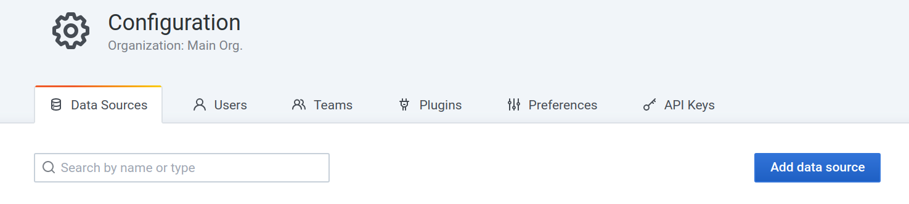
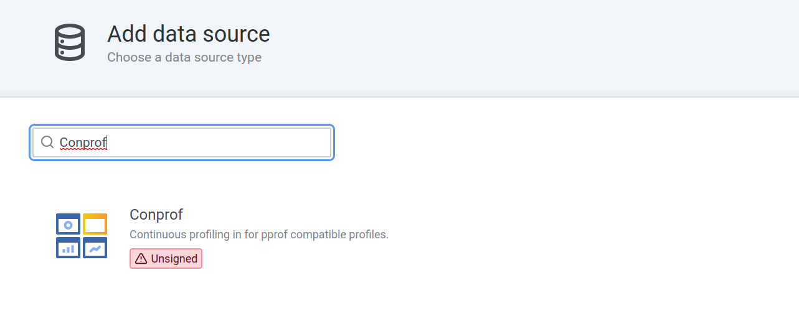
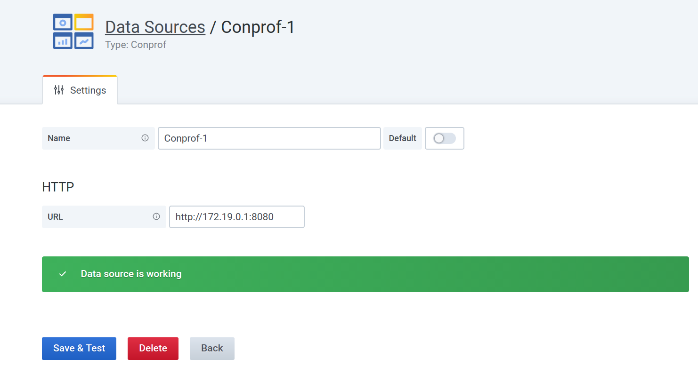
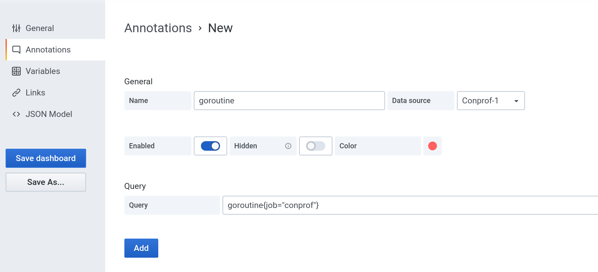
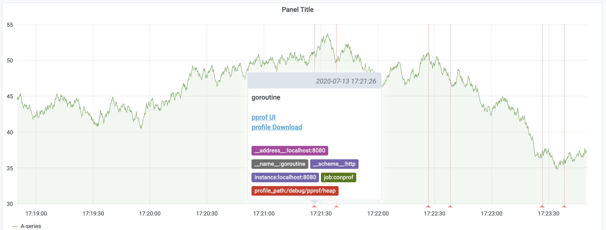

# Tutorial for Conprof Data source

## Configure the data source

Go to Grafana -> Configuration -> Data Sources, click `Add data source` button.

Enter Conprof into the search bar and then you can see the data source.

Enter the URL of Conprof, and click `Save & Test` to check availability.

It is best to make sure your network can access this URL from browser as well.

## Conprof Annotations Query

### Configure Annotation

Add a new annotation, choose type as `Conprof` and enter the query expression.

### View the results

To view the annotations, you should have a panel. If the annotation is enabled and there are samples at the time range, you can see the annotations in the dashboard.

There are also two links `pprof UI` and `profile Download` for each annotation, you can click these links to view the profile or download it.

